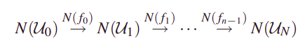
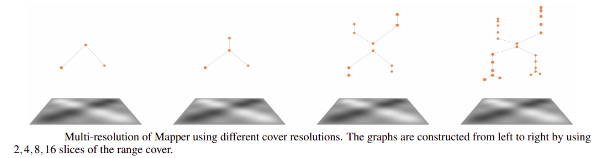

# MATF-NI-Mapper

## Short introduction to Topology

`Topology` is the math concerning continuous objects. 
Not sizes and shapes, but continuity. It is how
things are connected and where the `gaps` are. 
It explains how a material's shape can be 
completely deformed into new one without losing its 
core properties. 

**Definition (homotopy):** Let f, g : X → Y be maps. 
f is `homotopic` to g if there exists a map F : X×I → Y
such that F(x, 0) = f(x) and F(x, 1) = g(x) 
for all points x ∈ X. The map F is called a homotopy 
from f to g and we write it as f' F g.
More intuitvely, if we think of the second parameter 
of F as “time”, then F describes a
“continuous deformation” of f into g. At time 0 we 
have the function f, at time 1 we have the function g.

Famous example is the `mug and donut`
`homotopy`. Informally, two continous functions from
one topological space to another are called `homotopic`
if one can be `continuosly deformed` into another. Such
a deformation being called a `homotopy` between the 
two functions. [1, 2]

## Topological data analysis (TDA)

`Topological data analysis (TDA)` is an approach to the analysis
of datasets using techiniques from `topology`. It is usually combined
with other forms of analysis such as statistical or geometric
approaches. [1]

## Mapper - Introduction

`Mapper` is TDA algorithm is used for generalized
notion of coordinatization for high dimensional
datasets. Coordinatization can refer to choice of
real valued coordinate functions or data or
other notions of geometric representation like
`reeb graph`. [4]

## Mapper - Topological background and motivation

**Definition:** `Cover C of set X` is collection of sets
whose union includes X. Cover is `open cover` is all 
members are open sets.

**Example:** X is unit circle and C is set of circles
containing X.

**Definition:** `Nerve of an open covering C` is 
a construction of simplical complex N(C).

**Example:** From previous example we can form nerve of
open covering. Note: Obtained simplical complex 
approximates initial space.

**Definition:** `Partition of unity` of topological space
X is set of continuous functions R from X to [0, 1] where
for each point x ∈ X:
- there is a neighbourhood of x where all but finite number
of functions of R are 0,
- the sum of all the function values at x is 1.

**Definition:** Points v in the k-simplex correspond
to set of ordered k-tuples of real numbers 
(numbers are from interval [0, 1] and they sum up to 1).
We can intrepet these values as normalized masses.
This coordinate system is called `barycentric coordinate
system`.

**Example:** Barycentric coordinates of 2-simplex (triangle):

TODO (definition and examples): 
- topology
- map, continous maps (+base theorems)
- connected components and path connected components.

### Construction

Assume we have finite covering U = {Ua | a ∈ A} 
of space X (A is indexing set), 
we can define nerve of the covering U 
to be simplical complex N(U):
- Vertices of N(U) are named by index set A. 
- Family {a(0), ..., a(k)} forms k-simplex
in N(U) (vertices of simplex) if and only if Ua(0) ∩ Ua(1) ∩ ... ∩ Ua(k) is 
non-empty set. [3]

With defined partition of unity {Φa: X -> [0, 1] | a ∈ A} (∑α Φα(x)=1), 
we can obtain map from X to N(U):
- Let T: X -> A, T(x) = {a | x ∈ Ua}
(set of members of covers that contain x).
- Let ρ: X -> N(U) where ρ(x) is point in simplex
spanned by vertices a ∈ T(x) 
(spanned by k-simplex vertices) whose
barycentric coordinates are (Φa1(x), Φa2(x), ..., Φak(x))
where a1 (a(1)), a2, ..., ak are values from T(x).
Continuous map ρ provides kind of partial coordination of X 
using k-simplex from N(U). [3]

We can form finite covering V with continuous map f: X -> Z 
where Z is parameter space. Let parameter space Z
be equipped with finite open covering C = {Cb | b ∈ B} 
(B is indexing set). Let g be inverse map of f.
Map g is continuous since f is continuous. Hence, the
sets Vb := g(Cb) also form finite open 
covering of space X. We can now decompose Ub into
path connected components (Vb is union of connected
components). [3]

### Multiresolution structure

If we have two coverings U = {Ua | a ∈ A} 
and V = {Vb | b ∈ B} then `map of coverings` from U
to V is function f: A -> B so that for all a ∈ A,
we have Ua ⊆ Vf(a). Hence, we have induced
mapping of simplical complexes N(f): N(U) -> N(V). [3]

Consequently, if we have a family of
coverings Ui, i = 0,1,...,n, and maps of coverings 
fi : Ui → Ui+1 for each i, we obtain 
a diagram of simplicial complexes and simplicial maps: [3]

This means that when resolution of cover increases
(members of cover are decomposed into more "smaller"
members) the resulting "more detailed" 
simplical complex (vertices are consequently decomposed).
In case of graphs, they are more refined in sense that
there are more nodes inserted along the edges. 
Example: [6]

## Mapper - Implementation

## Toy Example - Iris

## Literature

[\[1\] Intro to Applied Topological Data Analysis](https://towardsdatascience.com/intro-to-topological-data-analysis-and-application-to-nlp-training-data-for-financial-services-719495a111a4)

[\[2\] When is a coffee mug a donut? Topology explains it](https://phys.org/news/2016-10-coffee-donut-topology.html)

[\[3\] Introduction to Topology](https://www.math.colostate.edu/~renzo/teaching/Topology10/Notes.pdf)

[\[4\] Topological Methods for the Analysis of High Dimensional
Data Sets and 3D Object Recognition - Gurjeet Singh, Facundo Mémoli and Gunnar Carlsson](https://diglib.eg.org/bitstream/handle/10.2312/SPBG.SPBG07.091-100/091-100.pdf?sequence=1&isAllowed=y)

[\[5\] S. Mardsic and J. Segal, Shape theory, North-Holland Publishing Company, 1982.]()

[\[6\] The Shape of an Image: A Study of Mapper on Images](https://www.researchgate.net/publication/320596185_The_Shape_of_an_Image_A_Study_of_Mapper_on_Images)