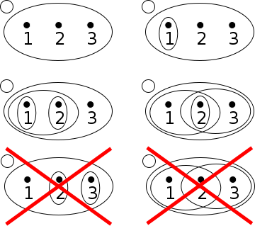
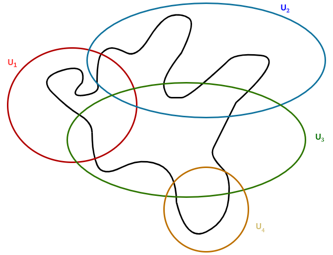
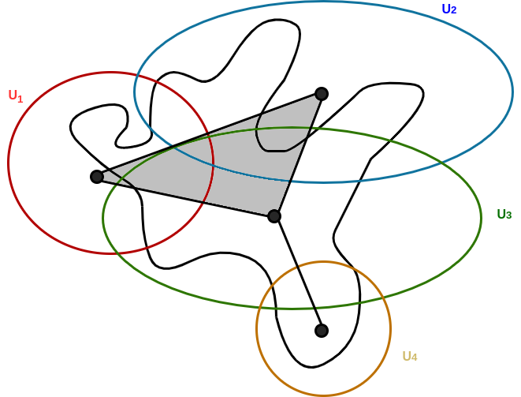
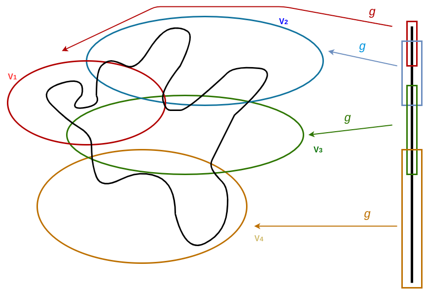
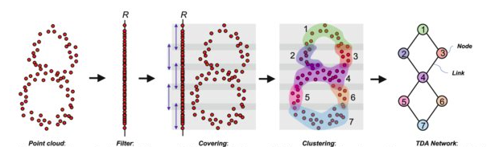

# MATF-NI-Mapper

## Short introduction to Topology

`Topology` is the math concerning continuous objects
(not sizes and shapes, but continuity). It is how
things are connected and where the `gaps` are. 
It explains how a material's shape can be 
completely deformed into new one without losing its 
core properties. [[1]](#1)

**Definition (homotopy):** Let f, g : X ⟶ Y be maps. 
f is `homotopic` to g if there exists a map F : X×I ⟶ Y
such that F(x, 0) = f(x) and F(x, 1) = g(x) 
for all points x ∈ X. The map F is called a homotopy 
from f to g and we write it as f' F g.
More intuitvely, if we think of the second parameter 
of F as “time”, then F describes a
“continuous deformation” of f into g. At time 0 we 
have the function f, at time 1 we have the function g.

Famous example is the `mug and donut homotopy`. Informally, two continous functions from
one topological space to another are called `homotopic`
if one can be `continuously deformed` into another. Such
a deformation being called a homotopy between the 
two functions. [[1]](#1)[[2]](#2)

## Topological data analysis (TDA)

`Topological data analysis (TDA)` is an approach to the analysis
of datasets using techiniques from `topology`. It is usually combined
with other forms of analysis such as statistical or geometric
approaches. [[1]](#1)

Famous TDa algorithm for visualization of high dimensional
data is `Mapper`.

## Mapper - Introduction

`Mapper` is TDA algorithm is used for generalized
notion of coordinatization for high dimensional
datasets. Coordinatization can refer to choice of
real valued coordinate functions or data or
other notions of geometric representation like
`reeb graph`. [[4]](#4)

## Mapper - Topological background and motivation

Mapper algorithm is explained in three sections:
- Theory required for understanding theory
behind mapper algorithm;
- Mapper: Construction of simplical complex (e.g. graph)
from cover;
- Mapper: Multiresolution motivation (level of detail).

### Definitions

**Definition:** `A topology τ on a set X` consists of subsets of X satisfying the following
properties:
1. The empty set ∅ and the space X are both sets in the topology;
2. The union of any collection of sets in τ is contained in τ;
3. The intersection of any finitely many sets in τ is also contained in τ.

All sets in topology are `open sets`. [[3]](#3)

**Examples (with visualization):** 
1. τ = {∅, {1, 2, 3}}
2. τ = {∅, {1}, {1, 2, 3}}
3. τ = {∅, {1}, {2}, {1, 2}, {1, 2, 3}}
4. τ = {∅, {1, 2}, {2, 3}, {2}, {1, 2, 3}}
5. τ = {∅, {2}, {3}, {1, 2, 3}}, missing: {2, 3} = {2} ∪ {3}. 
6. τ = {∅, {1, 2}, {2, 3}, {1, 2, 3}}, missing: {2} = {1, 2} ∩ {2, 3}.

**Definition:** `A topological space` is a pair (X, τ) 
where X is a set and τ a topology on a set X. [[3]](#3)

**Definition:** `Cover C of set X` is collection of sets
whose union includes X. Cover is `open cover` is all 
members are open sets. [[3]](#3)

**Example:** X is unit circle and C is set of circles
containing X.

**Definition:** `Nerve of an open covering C` is 
a construction of simplical complex N(C).

**Example:** From previous example we can form nerve of
open covering. Note: Obtained simplical complex 
approximates initial space.

**Definition:** `Partition of unity` of topological space
X is set of continuous functions R from X to [0, 1] where
for each point x ∈ X:
- there is a neighbourhood of x where all but finite number
of functions of R are 0,
- the sum of all the function values at x is 1.

**Definition:** Points v in the k-simplex correspond
to set of ordered k-tuples of real numbers 
(numbers are from interval [0, 1] and they sum up to 1).
We can intrepet these values as normalized masses.
This coordinate system is called `barycentric coordinate
system`.

**Example:** Barycentric coordinates of 2-simplex (triangle):

- connected components and path connected components.

**Definition:** A topological space X is said to be 
`disconnected`
if it is the union of two disjoint nonempty open sets. 
Otherwise, X is said to be `connected`. We can
define relation x ~ y if there exists connected subset
of X that is containing them. It can be shown that this relation is equivalence
relation. Equilvalence classes of this relation are
called `connected components`. [[3]](#3)

**Definition:**
The space X is said to be `path-connected` if for any 
two points x,y ∈ X there exists a continuous 
function f from the unit interval [0,1] 
to X with f(0) = x and f(1) =
y. (This function is called a path from x to y.)
We can now define relation x ~ y if x is path connected
to y. It can be shown that this relation is equivalence
relation. Equilvalence classes of this relation are
called `path-connected components`.

### Construction

Assume we have finite covering U = {Ua | a ∈ A} 
of space X where A is indexing set (image _construction-1_). 

construction-1: Space X with finite covering U = {U1, U2, U3, U4}

We can define nerve of the covering U 
to be simplical complex N(U) (image _constructin-2_):
- Vertices of N(U) are named by index set A. 
- Family {a0, ..., ak} forms k-simplex
in N(U) (vertices of simplex) if and only if Ua0 
∩ Ua1ak is 
non-empty set. [[3]](#3)

construction-2: Nerve of covering N(U) for U 

With defined partition of unity {Φa: X ⟶ [0, 1] | a ∈ A} 
(∑α Φα(x)=1), 
we can obtain map from X to N(U):
- Let T: X ⟶ A, T(x) = {a | x ∈ Ua}
(set of members of covers that contain x).
- Let ρ: X ⟶ N(U) where ρ(x) is point in simplex
spanned by vertices a ∈ T(x) 
(spanned by k-simplex vertices) whose
barycentric coordinates are (Φa1(x), 
Φa2(x), ..., Φak(x))
where a1, a2, ..., ak are values from T(x).
Continuous map ρ provides kind of partial coordination of X 
using k-simplex from N(U). [[3]](#3)

We can form finite covering V with continuous 
map f: X ⟶ Z where Z is parameter space. 
Let parameter space Z be equipped with 
finite open covering C = {Cb | b ∈ B} 
where B is indexing set (image _construction-3_). 

construction-3: Mapping of covering C to Z 

Let g be inverse map of f.
Map g is continuous since f is continuous. 
Hence, the sets Vb := g(Cb) also form finite open 
covering of space X (image _construction-4_). 
We can now decompose Ub into
path connected components (Vb is union of connected
components). [[3]](#3)

construction-4: Forming covering using inverse function g

### Multiresolution structure

If we have two coverings U = {Ua | a ∈ A} 
and V = {Vb | b ∈ B} then `map of coverings` from U
to V is function f: A ⟶ B so that for all a ∈ A,
we have Ua ⊆ Vf(a). Hence, we have induced
mapping of simplical complexes N(f): N(U) ⟶ N(V). [[3]](#3)

Consequently, if we have a family of
coverings Ui, i = 0,1,...,n, and maps of coverings 
fi : Ui → Ui+1 for each i, we obtain 
a diagram of simplicial complexes and simplicial maps: 
[[3]](#3)

This means that when resolution of cover increases
(members of cover are decomposed into more "smaller"
members) the resulting "more detailed" 
simplical complex (vertices are consequently decomposed).
In case of graphs, they are more refined in sense that
there are more nodes inserted along the edges. 
Example: [[6]](#6)

## Mapper - Implementation

Statistical version of mapper is used for implementation.
Idea is to use clustering to partition space into connected
components. Assume we have N data points x ∈ X, `filter 
function (lens)` f: X ⟶ R and inter-point distance matrix
(explicitly or implicitly given some metric). Example:
image mapper-example: `point cloud`. Algorithm:
1. **Form cover for range I of function f**:
   - I = f(X);
   - We can form cover by splitting I into set of intervals S
   of equal length which overlap.
   - Note: We have two parameters here: Size of set S (_n_)
   (or length of interval _l_) and percentage overlap 
   between successive intervals (_p_).
   - Example: 
     * X ⊆ [0,2]x[0,2]
     * f(x, y) = y ⇒ I ⊆ [0,2]
     * _n_ = 4, _p_ = 10%
     * S = {[0, 0.55], [0.45, 1.05], [0.95, 1.55], [1.45, 2]}
   - Example: image mapper-example: `filter`
2. **Calcute preimage for each member of cover I:**
   - Xi = f-1[Ii]
   - set V = {Xi | i ∈ {1...n}} forms cover of X
   - Example: image mapper-example: `covering`
3. **Cluster each member of V:**
   - Clustering algorithm is arbitrary, but it should
   have some desired characteristics which will be
   noted later.
   - Each cluster forms vertex
   vXi, Cj 
   where Xi is clustered member of cover and
   Ci, j is cluster obtained from clustering
   Xi
   - Example: image mapper-example: `clustering`
4. **Form simplical complex (or graph):**
   - In case of forming simplical complex: 
   Set of vertices {vi1, j1, 
   vi2, j2, ..., 
   vik, jk}
   form k-simplex if 
   Ci1, j1 ∩ 
   Ci2, j2 ∩ ... ∩ 
   Cik, jk ≠ ∅
   - In case of forming graph (special case: Vertices
   va, b and vc, d are connected
   if Ca, b ∩ Cc, d ≠ ∅
   - Example: image mapper-example: `TDA network`

mapper-example: Applying mapper [[8]](#8)

### Clustering desired characteristics

Besides choosing a good filter function, finding a good 
clustering is another important challenge for 
decent data visualization. Mapper algorithm does
not place any conditions on the clustering but
they are some desired characteristics: [[4]](#4)
- Clustering should not be restricted to Euclidean space. 
We can give inter-point distance matrix as an input to
mapper algorithm.
- Number of clusters should not be specified beforehand. 
We can use algorithm that do not require number of clusters
specified before applying clustering algorithm. Examples:
DBSCAN, Agglomerative (hierarchical) clustering, ...

## Toy Example - 01_iris

`Iris dataset` is well known dataset consisting of three
classes of flowers (`setosa`, `versicolor`, `virginica`) 
with 50 instances for each class. This dataset is associated
with classification (supervised) task in machine learning. [[9]](#9)
- Features: `SepalLengthCm`, `SepalWidthCm`, 
`PetalLengthCm`, `PetalWidthCm`
- Target: `Species`

Custom mapper algorithm prototype is used to test 
class separability with 
visualization. Size of nodes is correlated to number of 
instances that node contains. Parameters:
- Filter function: Projection on first PCA component
- Clustering: [DBSCAN](https://en.wikipedia.org/wiki/DBSCAN)
- Number of intervals: 10
- overlap percentage: 50%

In image on left we 
can see nodes colored by `mode` of each cluster (node).
We can see three "bigger" clusters:
- `setosa` cluster which is isolated from `versicolor` 
and `virginica`
- `virginica` and `versicolor` clusters which are not isolated
from each other. 

On image on the right we can see entropies of 
the nodes and expect classes `virginica` and 
`versicolor` to mix when applying trained a classification model
while `setosa` should be easily learned to be separated by
the model.

We could also make another plot after training model to see
model certainty i.e. where model is not sure which class
does the instance belong to.

## Disaster Tweets Dataset

Link to Kaggle competition: [Natural Language Processing with Disaster Tweets](https://www.kaggle.com/c/nlp-getting-started)

Each sample in the train and test set has the following information:
- The `text` of a tweet
- A `keyword` from that tweet (although this may be blank!)
- The `location` the tweet was sent from (may also be blank)

**Goal**: Predicting whether a given tweet is about a real disaster or not. If so, predict a 1. If not, predict a 0.

**Data**:
Columns
- `id` - a unique identifier for each tweet
- `text` - the text of the tweet
- `location` - the location the tweet was sent from (may be blank)
- `keyword` - a particular keyword from the tweet (may be blank)
- `target` - denotes whether a tweet is about a real disaster (1) or not (0)

### Exploratory Data Analysis

Exploratory data analysis od dataset can be found on 
this [link](https://github.com/Robotmurlock/MATF-NI-Mapper/blob/main/02_tweet_disaster/eda.ipynb).

## Literature

<a id="1">[1]</a> 
[Intro to Applied Topological Data Analysis](https://towardsdatascience.com/intro-to-topological-data-analysis-and-application-to-nlp-training-data-for-financial-services-719495a111a4)

<a id="2">[2]</a> 
[When is a coffee mug a donut? Topology explains it](https://phys.org/news/2016-10-coffee-donut-topology.html)

<a id="3">[3]</a> 
[Introduction to Topology](https://www.math.colostate.edu/~renzo/teaching/Topology10/Notes.pdf)

<a id="4">[4]</a> 
[Topological Methods for the Analysis of High Dimensional
Data Sets and 3D Object Recognition - Gurjeet Singh, Facundo Mémoli and Gunnar Carlsson](https://diglib.eg.org/bitstream/handle/10.2312/SPBG.SPBG07.091-100/091-100.pdf?sequence=1&isAllowed=y)

<a id="5">[5]</a> 
[S. Mardsic and J. Segal, Shape theory, North-Holland Publishing Company, 1982.]()

<a id="6">[6]</a> 
[The Shape of an Image: A Study of Mapper on Images](https://www.researchgate.net/publication/320596185_The_Shape_of_an_Image_A_Study_of_Mapper_on_Images)

<a id="7">[7]</a> 
[Article: Topology based data analysis identifies a subgroup of breast cancers with a unique mutational profile and excellent survival](https://www.pnas.org/content/108/17/7265)

<a id="8">[8]</a> 
[tmap: an integrative framework based on topological data analysis for population-scale microbiome stratification and association studies](https://www.researchgate.net/publication/338120777_tmap_an_integrative_framework_based_on_topological_data_analysis_for_population-scale_microbiome_stratification_and_association_studies)

<a id="9">[9]</a> 
[Iris dataset](https://archive.ics.uci.edu/ml/datasets/iris)